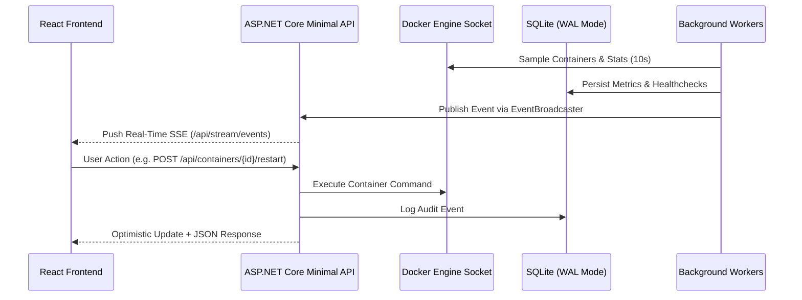

<div align="center">

[](architecture.md)
[](architecture.tr.md)

</div>

# Corvus — Repository and System Architecture

This document specifies the current file organization, layered architecture, background services, and data flow of Corvus.

---

## 📁 Directory Structure

```
corvus/
├── docker-compose.yml
├── Dockerfile                    # Multi-stage: Frontend build + .NET 9 AOT build + minimal runtime
├── README.md                     # Project overview and quick start (English)
├── README.tr.md                  # Project overview and quick start (Türkçe)
├── CONTRIBUTING.md               # Contribution and architecture guidelines (English)
├── CONTRIBUTING.tr.md            # Contribution and architecture guidelines (Türkçe)
├── LICENSE
│
├── src/
│   ├── Corvus.Api/                # Backend — ASP.NET Core Minimal API, .NET 9 Native AOT
│   │   ├── Program.cs             # Application entry point, DI, and Minimal API mapping (113 lines)
│   │   ├── Corvus.Api.csproj
│   │   ├── Endpoints/             # Resource-oriented Minimal API endpoints (extension methods)
│   │   │   ├── AuthEndpoints.cs          # Session auth, registration toggle, and Zero-Trust SSO
│   │   │   ├── BackupEndpoints.cs        # One-click SQLite VACUUM INTO snapshot download
│   │   │   ├── ContainersEndpoints.cs    # Containers, /stats, /logs/stream, lifecycle, Web Terminal (/terminal), Dry-Run Prune (/system-df, /prune/selective), Inspect (/inspect), Update (/update), and Tags (/tags)
│   │   │   ├── DashboardEndpoints.cs     # Dashboard aggregated KPI summary
│   │   │   ├── IncidentEndpoints.cs      # Incident and maintenance announcement CRUD & lifecycle
│   │   │   ├── MetricsEndpoints.cs       # Host system metrics time-series (1h-1y)
│   │   │   ├── NotificationEndpoints.cs  # Multi-channel alert test endpoint (Discord, Telegram, SMTP, Slack, Ntfy, Webhooks)
│   │   │   ├── PushEndpoints.cs          # Push webhooks and Dead Man's Snitch (/push-monitors)
│   │   │   ├── ServicesEndpoints.cs      # Service CRUD and /reorder
│   │   │   ├── SettingsEndpoints.cs      # Dynamic system settings (RequireAdmin) and database size telemetry
│   │   │   ├── StatusPageEndpoints.cs    # Public unauthenticated status summary (/api/status-page)
│   │   │   ├── StreamEndpoints.cs        # Live Server-Sent Events stream (/api/stream/events)
│   │   │   ├── UptimeEndpoints.cs        # Service uptime check history, HTTP body assertion, and ICMP ping diagnostics
│   │   │   └── UserEndpoints.cs          # Administrator RBAC user management CRUD endpoints (/api/users)
│   │   ├── BackgroundServices/    # Continuous background worker threads
│   │   │   ├── ContainerDiscoveryService.cs  # Docker socket periodic container discovery (10s)
│   │   │   ├── SystemMetricsCollector.cs     # Host CPU/RAM/Disk/Net metrics sampler (15s)
│   │   │   ├── UptimeCheckerService.cs       # 3-state HTTP/TCP/ICMP ping, body assertions, proactive SSL early warnings, and Snitch checks
│   │   │   ├── MemoryTrimmerBackgroundService.cs # Periodic native memory trimming, PRAGMA wal_checkpoint(TRUNCATE), Gen2 compaction & malloc_trim
│   │   │   └── RetentionCleanupService.cs    # Dynamic retention cleanup, hourly metrics rollup (system_metrics_hourly), dual retention (7d raw / 365d hourly), SQLite VACUUM & Gen2 compaction (24h)
│   │   ├── Data/                  # Persistence and data access layer (Dapper.AOT + SQLite)
│   │   │   ├── DbConnectionFactory.cs        # SQLite WAL, busy_timeout=5000, and PRAGMA tuning
│   │   │   ├── DatabaseMigrator.cs           # DbUp sequential migration runner
│   │   │   ├── IncidentRepository.cs         # Incident and maintenance notice data access
│   │   │   ├── ServicesRepository.cs         # Service definition and override queries
│   │   │   ├── PushMonitorRepository.cs      # Dead Man's Snitch data access
│   │   │   ├── UptimeRepository.cs           # Uptime history data access and daily rollups
│   │   │   ├── MetricsRepository.cs          # Host telemetry time-series storage, hourly rollup aggregation, and downsampled CTE queries
│   │   │   ├── BackupRepository.cs           # Push backup event logs
│   │   │   ├── UserRepository.cs             # User accounts, RBAC roles and password hashing
│   │   │   ├── SessionRepository.cs          # Persistent SQLite session store (user_sessions table)
│   │   │   ├── SettingsRepository.cs         # Key-value dynamic application settings
│   │   │   └── Migrations/                   # Ordered migration SQL scripts
│   │   │       ├── 001_init.sql
│   │   │       ├── 002_add_users.sql
│   │   │       ├── 003_roadmap_features.sql
│   │   │       ├── 004_performance_indexes.sql
│   │   │       ├── 005_service_overrides_extended.sql
│   │   │       ├── 006_uptime_advanced_options.sql
│   │   │       ├── 007_opt_in_uptime.sql         # Opt-in uptime, self-healing status reset and index
│   │   │       ├── 008_service_incidents.sql     # Service incidents and maintenance announcements schema
│   │   │       ├── 009_uptime_rollup_and_transition.sql # Uptime daily rollup & transition state tracking
│   │   │       ├── 010_user_sessions.sql         # Persistent user sessions table
│   │   │       ├── 011_expected_body.sql         # HTTP response body keyword & regex validation
│   │   │       ├── 012_metrics_hourly_rollup.sql # Hourly telemetry rollup table and indexes
│   │   │       └── 013_service_tags.sql          # Environment tags column for services & overrides
│   │   ├── Models/                 # DTOs and Database Entities
│   │   │   ├── Service.cs                    # Service entity (check_type: http, tcp, ping, port, ssl, expected_body, is_public, display_order)
│   │   │   ├── ServiceIncident.cs            # Incident announcement entity
│   │   │   ├── ServiceOverride.cs            # Docker label override model
│   │   │   ├── PushMonitor.cs                # Dead Man's Snitch entity
│   │   │   ├── DockerModels.cs               # Docker Engine API schemas, prune requests/results, exec resize frames, inspect models
│   │   │   ├── DockerActionResult.cs         # Container action result response
│   │   │   ├── SystemMetric.cs               # System hardware metrics sample
│   │   │   ├── UptimeCheck.cs                # Health check audit log
│   │   │   ├── BackupEvent.cs                # External push backup ping
│   │   │   ├── User.cs                       # User authentication & RBAC entity (admin, viewer)
│   │   │   ├── VersionInfo.cs                # Update checker DTO
│   │   │   └── CorvusJsonSerializerContext.cs # .NET 9 Native AOT JsonSourceGeneration context
│   │   ├── Utils/                  # Helper utilities
│   │   │   ├── StatusCodeMatcher.cs          # HTTP status code pattern matcher (ranges and discrete codes)
│   │   │   ├── NativeMemoryTrimmer.cs        # Platform-guarded libc malloc_trim native memory reclamation
│   │   │   └── HttpBodyValidator.cs          # Zero-allocation 64 KB bounded stream content validator with ReDoS timeout
│   │   └── Services/                # Core domain business logic
│   │       ├── DockerHttpClient.cs           # SocketsHttpHandler direct socket client (exec, prune, stats, logs)
│   │       ├── DockerService.cs              # Container operations, system prune, stats, and label parsing
│   │       ├── DockerLogDemuxer.cs           # Zero-alloc multiplexed Docker stdout/stderr demuxer
│   │       ├── IFlappingDetector.cs          # Sliding-window flapping detection interface
│   │       ├── FlappingDetector.cs           # In-memory sliding-window transition tracker & alert debounce engine
│   │       ├── NotificationService.cs        # Multi-channel alert dispatcher (Discord, Telegram, SMTP Email, Slack, Ntfy, Webhook)
│   │       ├── EventBroadcaster.cs           # Bounded Channel SSE real-time event publisher
│   │       ├── AuthService.cs                # Zero-Trust SSO, 100k PBKDF2 hashing, persistent SQLite session store & RBAC
│   │       ├── CorvusAuthFilter.cs           # Minimal API EndpointFilter authentication & RBAC authorization layer
│   │       └── UpdateCheckerService.cs       # GitHub Releases version checking
│   │
│   └── Corvus.Web/                 # Frontend — TypeScript + React 19 + Vite + Tailwind CSS v4
│       ├── vite.config.ts          # Optimized Vite build with manual vendor chunks
│       ├── src/
│       │   ├── main.tsx
│       │   ├── App.tsx             # React.lazy route code-splitting, centralized 401 listener & SSE streaming
│       │   ├── types/              # Modular type contracts (Clean Architecture)
│       │   │   └── index.ts        # All API and DTO interface types including CheckType ('http' | 'tcp' | 'docker' | 'ping')
│       │   ├── api/                # Modular API client layer
│       │   │   ├── http.ts         # fetchJson (centralized corvus_unauthorized event), in-memory SWR cache, invalidateCache
│       │   │   ├── auth.ts         # Authentication endpoints
│       │   │   ├── services.ts     # Service CRUD and reordering
│       │   │   ├── containers.ts   # Container operations, batch stats (/stats-summary), logs, inspect, and update
│       │   │   ├── uptime.ts       # Uptime checks and push monitors
│       │   │   ├── metrics.ts      # Hardware metrics
│       │   │   ├── settings.ts     # Settings and backup
│       │   │   ├── index.ts        # Unified API object
│       │   │   └── client.ts       # Backward compatibility re-export layer
│       │   ├── i18n/               # Compile-time type-safe multi-language system
│       │   │   ├── en.ts           # Primary English dictionary
│       │   │   ├── tr.ts           # Turkish translation dictionary
│       │   │   ├── types.ts        # DeepStringify and schema types
│       │   │   └── index.tsx       # I18nProvider and useI18n hook
│       │   ├── utils/              # Modular helper and utility functions
│       │   │   ├── url.ts          # Service URL formatter and sanitization
│       │   │   ├── format.ts       # Byte sizing (B, KB, MB, GB, TB) formatter
│       │   │   ├── grouping.ts     # Docker Compose intelligent grouping logic
│       │   │   └── tagColor.ts     # FNV-1a hash pastel palette and semantic environment presets
│       │   ├── components/         # Shared global UI components ONLY
│       │   │   ├── common/                   # Shared cross-domain components
│       │   │   │   └── TagFilterBar.tsx      # Reusable multi-tag filter bar with real-time counters
│       │   │   ├── Sidebar.tsx               # Desktop rail menu (hidden lg:flex)
│       │   │   ├── BottomNav.tsx             # Mobile Glass Bottom Navigation Bar — 7-tab frosted glass bar
│       │   │   ├── StatusBadge.tsx           # Health indicator badge (healthy, degraded, down)
│       │   │   ├── TagBadge.tsx              # Reusable tag chip badge with pastel styles and click actions
│       │   │   ├── TagInput.tsx              # Dynamic chip tag input component with auto-suggestions
│       │   │   ├── LanguageSwitch.tsx        # Compact & full interface language switcher
│       │   │   ├── EmailRecipientInput.tsx   # Interactive pills/tags multi-recipient email input component
│       │   │   └── RegistrationPromptModal.tsx # Global first-admin prompt modal
│       │   └── pages/              # Modular feature-driven page directories
│       │       ├── AuthPage/
│       │       │   └── index.tsx             # Sign in and initial registration view
│       │       ├── Containers/
│       │       │   ├── index.tsx             # Page orchestrator & state manager (<250 lines)
│       │       │   ├── ContainerList.tsx     # Responsive mobile cards and desktop table
│       │       │   ├── ComposeStackGroup.tsx # Collapsible Docker Compose stack accordions
│       │       │   ├── ContainerStatsBadges.tsx # Real-time CPU, RAM, Net I/O badges
│       │       │   ├── ContainerActionButtons.tsx # Lifecycle controls, log viewer, and web terminal trigger
│       │       │   ├── ContainerLogsModal.tsx   # Live container log streaming terminal
│       │       │   ├── ContainerTerminalModal.tsx # Interactive in-browser web terminal (@xterm/xterm, shell selector, PTY resize)
│       │       │   ├── ContainerTagsModal.tsx   # Container environment tag assignment modal
│       │       │   ├── SystemPruneModal.tsx     # Safe two-stage dry-run disk space audit and cleanup dialog
│       │       │   ├── detail/                  # Modular container detail tabs
│       │       │   │   ├── ContainerDetailModal.tsx # Orchestrator multi-tab container inspection dialog
│       │       │   │   ├── ContainerOverviewTab.tsx # ID, image, state, command, and quick actions toolbar
│       │       │   │   ├── ContainerEnvTab.tsx      # Searchable env vars with secret masking toggle & .env copy
│       │       │   │   ├── ContainerNetworkingTab.tsx # Port bindings and attached Docker network details
│       │       │   │   ├── ContainerStorageTab.tsx  # Volume & bind mounts with RW/RO permissions
│       │       │   │   └── ContainerResourcesTab.tsx # Zero-downtime CPU, RAM, and restart policy updater
│       │       │   └── prune/                   # Modular selective dry-run prune tables
│       │       │       ├── PruneContainersTable.tsx # Stopped containers audit table with checkboxes
│       │       │       ├── PruneImagesTable.tsx     # Unused images audit table with size indicators
│       │       │       ├── PruneVolumesTable.tsx    # Orphaned volumes table with data-loss warning banner
│       │       │       └── PruneBuildCacheCard.tsx  # Docker build cache reclaim card
│       │       ├── Dashboard/
│       │       │   ├── index.tsx             # Consolidated KPI summary & active services
│       │       │   ├── SystemPulseHero.tsx   # Live system pulse, network I/O & update checker
│       │       │   ├── SystemKpiStrip.tsx    # 2-column compact KPI strip & full-width Disk bar
│       │       │   ├── AttentionRequiredCard.tsx # Degraded services and SSL certificate warning card
│       │       │   └── ActiveContainersWidget.tsx # 2-column responsive active containers card
│       │       ├── Profile/
│       │       │   ├── index.tsx             # Profile and user management page shell
│       │       │   ├── ProfileSecurityTab.tsx # Self-service password change and 2FA tab
│       │       │   ├── ProfileUsersTab.tsx   # Admin user management and role assignment tab
│       │       │   └── AddUserModal.tsx      # Modal for creating new users
│       │       ├── PublicStatus/
│       │       │   ├── index.tsx             # Unauthenticated status page (/status)
│       │       │   ├── PublicStatusCategoryGroup.tsx # Collapsible category accordion groups
│       │       │   ├── PublicStatusIncidentBanner.tsx # Real-time incident and scheduled maintenance notice banner
│       │       │   ├── PublicStatusServiceBar.tsx    # Interactive 30-check latency status bar
│       │       │   └── PublicStatusServiceCard.tsx   # Detailed service status card with uptime metrics
│       │       ├── Services/
│       │       │   ├── index.tsx             # Service launcher, drag & drop reordering and tag filter
│       │       │   ├── ServiceCard.tsx       # Service card (HTTP, TCP, PING, Docker & Tag badges)
│       │       │   ├── TagFilterBar.tsx      # Real-time multi-tag filter bar with service counters
│       │       │   ├── AddServiceModal.tsx   # Modal for creating manual services (with TagInput, ICMP Ping & body options)
│       │       │   ├── EditServiceModal.tsx  # Modular modal for service endpoint, reverse proxy domain, check type & tags
│       │       │   └── AdvancedCheckOptions.tsx # Modular accordion for check interval, retries, TLS, body assertion & status codes
│       │       ├── Settings/
│       │       │   ├── index.tsx             # Unified single-column (max-w-4xl) settings shell with header version badge
│       │       │   ├── GeneralSettingsTab.tsx # General options, retention, and DB size telemetry
│       │       │   ├── NotificationSettingsTab.tsx # Multi-channel alert configuration (Discord, Telegram, SMTP, Slack, Ntfy, Webhooks)
│       │       │   ├── BackupSettingsTab.tsx # Dual-mode internal/external backup manager
│       │       │   └── notifications/        # Modular notification channel panels
│       │       │       ├── EmailChannelPanel.tsx       # SMTP host, port, TLS, from name and multi-recipient configuration
│       │       │       ├── SlackChannelPanel.tsx       # Slack incoming webhook URL and channel test trigger
│       │       │       ├── FlappingProtectionCard.tsx  # Flapping transition thresholds, window, and recovery checks
│       │       │       └── NotificationEventFilters.tsx # Granular event triggers (down, up, ssl, flapping)
│       │       ├── SystemMetrics/
│       │       │   ├── index.tsx             # Time-series telemetry shell & period filter (1h, 6h, 12h, 24h, 7d, 30d, 90d, 1y)
│       │       │   ├── SystemKpiCards.tsx    # Live hardware utilization metric cards
│       │       │   ├── CpuMetricsChart.tsx   # CPU load area chart
│       │       │   ├── RamMetricsChart.tsx   # Memory utilization area chart
│       │       │   └── DiskStorageCard.tsx   # Disk usage and partition distribution
│       │       └── Uptime/
│       │           ├── index.tsx             # Uptime shell and tab selector
│       │           ├── PingUptimeTab.tsx     # HTTP/TCP/ICMP ping, latency, and SSL tracking main tab
│       │           ├── PushMonitorsTab.tsx   # Dead Man's Snitch cron monitor list
│       │           ├── IncidentsTab.tsx      # Incident and scheduled maintenance management tab
│       │           ├── AddSnitchModal.tsx    # Modal for creating push monitors
│       │           ├── UptimeStatsCards.tsx  # Target URL card and edit endpoint trigger
│       │           ├── UptimeRecentChecks.tsx# Historical check list with status badges
│       │           ├── UptimeBar.tsx         # Historical 90-day uptime status bar
│       │           └── components/           # Modular Uptime sub-components
│       │               ├── DiscoveredServicesSection.tsx # Unmonitored discovered services pool
│       │               ├── EnableUptimeModal.tsx          # Smart pre-filled live connection test modal
│       │               ├── AddIncidentModal.tsx           # Modal for creating and publishing service incidents
│       │               └── DisableUptimeDialog.tsx        # Opt-out confirmation dialog
│       └── wwwroot/                # Production compiled bundle output (hosted by Corvus.Api)
│
├── tests/
│   └── Corvus.Api.Tests/           # xUnit Test Suite (223 Passing Tests)
│       ├── AuthServiceTests.cs
│       ├── ContainerTagsTests.cs     # Container tags CRUD, merging, and persistence tests
│       ├── DockerServiceTests.cs     # Container operations, system prune, micro-cache, and batch stats tests
│       ├── DockerLogDemuxerTests.cs
│       ├── FlappingDetectorTests.cs  # Sliding-window transition tracking and flapping alert debounce tests
│       ├── HttpBodyValidatorTests.cs # Zero-allocation stream content verification & ReDoS timeout tests
│       ├── MemoryTrimmerTests.cs     # Native memory trimmer and GC optimization tests
│       ├── MetricsRepositoryTests.cs # Hourly aggregation, dual retention cleanups, and downsampling query tests
│       ├── NotificationServiceTests.cs # Multi-channel dispatch tests (Discord, Telegram, SMTP, Slack, Ntfy, Webhooks)
│       ├── RoadmapFeaturesTests.cs
│       ├── UpdateCheckerTests.cs
│       ├── StatusCodeMatcherTests.cs
│       └── DatabaseMigrationAndRepositoryTests.cs
│
└── docs/                           # Technical specifications and architectural guides
    ├── branding/                   # Hex Sentinel brand identity, SVG master assets, and web icons
    │   ├── BRAND_GUIDELINES.md     # Logo guidelines, clear space, palette, and typography
    │   ├── svg/                    # Scalable vector master files and lockups
    │   └── web-icons/              # Favicon, apple-touch-icon, PWA icons, and manifest
    ├── architecture.md             # System architecture (English)
    ├── architecture.tr.md          # System architecture (Türkçe)
    ├── specification.md            # Technical specification (English)
    ├── specification.tr.md         # Technical specification (Türkçe)
    ├── design-system.md            # Design system and UI tokens (English)
    └── design-system.tr.md         # Design system and UI tokens (Türkçe)
```

---

## 🏛️ Clean Architecture & Modularity Principles

Corvus strictly adheres to **Clean Architecture** and **Single Responsibility** principles to maintain an elegant, maintainable, and open-source contributor-friendly codebase:

### 1. No Monolithic Files (Anti-Blob Rule)
- No single file should exceed its core responsibility. Pages are decomposed into clear feature directories (`pages/<Feature>/index.tsx`), and auxiliary tabs, modals, and list items are extracted into self-contained sub-components.

### 2. Centralized API Service Layer
- UI components **never** perform raw `fetch()` calls or handle HTTP protocol details directly.
- All backend communication is encapsulated in modular files under `src/api/` (`http.ts`, `services.ts`, `containers.ts`, etc.) with strict TypeScript typing and built-in SWR in-memory caching.

### 3. Feature-Scoped Modals and Tabs
- Modals, dialogs, and tabs that belong to a single page are colocated within that page's feature folder (e.g. `pages/Services/AddServiceModal.tsx`, `pages/Uptime/AddSnitchModal.tsx`, `pages/Containers/ContainerLogsModal.tsx`).
- `src/components/` is strictly reserved for truly global, cross-page elements (`Sidebar`, `StatusBadge`, `LanguageSwitch`, `RegistrationPromptModal`).

### 4. Utility Isolation
- Formatting, mathematical transforms, and URL normalization are never buried inside UI render trees. They reside in `src/utils/` (`url.ts`, `format.ts`, `grouping.ts`) and are covered by clean function signatures.

### 5. Backend Vertical Slices
- Endpoints are grouped cleanly by domain in `Endpoints/` as extension methods (`app.MapContainersEndpoints()`, `app.MapServicesEndpoints()`).
- Data access is segregated into dedicated Dapper repositories in `Data/`.
- Background tasks run as decoupled, resilient `BackgroundService` workers.

---

## 🔄 Data Flow & Real-Time Updates


```mermaid
sequenceDiagram
    participant Browser as React Frontend
    participant API as ASP.NET Core Minimal API
    participant Docker as Docker Engine Socket
    participant SQLite as SQLite (WAL Mode)
    participant Worker as Background Workers

    Worker->>Docker: Sample Containers & Stats (10s)
    Worker->>SQLite: Persist Metrics & Healthchecks
    Worker->>API: Publish Event via EventBroadcaster
    API-->>Browser: Push Real-Time SSE (/api/stream/events)
    Browser->>API: User Action (e.g. POST /api/containers/{id}/restart)
    API->>Docker: Execute Container Command
    API->>SQLite: Log Audit Event
    API-->>Browser: Optimistic Update + JSON Response
```

---

## 🧠 Memory Resilience, Caching & In-Memory Optimizations

Corvus implements a multi-tier optimization architecture to sustain system memory usage within **30–45 MB** without relying on an external cache server (such as Redis):

1. **Zero-Dependency Micro-Cache:**
   - Docker socket reads (`GetContainersAsync`) and Dashboard summaries (`GET /api/dashboard/summary`) are cached for 2.5 seconds.
   - Uptime 24-hour percentage aggregations (`Get24hUptimePercentagesAsync`) are micro-cached for 5 seconds.
   - Rapid navigation between views reduces Docker socket calls and SQLite allocations by more than 90%.
2. **Batch Stats Endpoint:**
   - Replaces N+1 parallel socket reads with a single consolidated stream via `GET /api/containers/stats-summary`, gathering resource stats for all running containers at once.
3. **Smart Container Discovery Fingerprinting & Inspect Cache:**
   - `ContainerDiscoveryService` caches container environment variables by container ID and image ID (`_inspectCache`), preventing redundant Docker socket `inspect` calls on every polling cycle.
   - `ComputeFingerprint` algorithm hashes active container status and URL strings. When no state change is detected, SQLite write transactions are skipped entirely, eliminating unnecessary disk I/O and log churn.
4. **.NET 9 Elastic Memory Tuning & Hard GC Bounds:**
   - `DOTNET_GCConserveMemory=9`: Enforces aggressive decommit of idle virtual memory pages back to the Linux kernel (`madvise`) immediately after traffic bursts subside.
   - `DOTNET_GCHeapHardLimit=0x3000000`: Caps the managed GC heap at 48 MB, ensuring stable operation on constrained VPS instances.
   - `MALLOC_ARENA_MAX=2` and `MALLOC_TRIM_THRESHOLD_=65536`: Restricts glibc multi-threaded memory allocation to prevent native heap fragmentation across background threads.
5. **Scheduled Native & Managed Memory Trimming (`MemoryTrimmerBackgroundService`):**
   - Runs automatically every 3 minutes: flushes pooled SQLite connections (`SqliteConnection.ClearAllPools()`), runs an optimized Gen 1 GC pass, and calls libc `malloc_trim(0)` to return unused native allocator pages directly to the host OS.
   - `SystemMetricsCollector` reads `/proc/meminfo` via streaming `File.ReadLines()`, short-circuiting as soon as `MemTotal` and `MemAvailable` lines are parsed without loading the full file into memory.
6. **Zero-Allocation HTTP Health Checks:**
   - HTTP health checks in `UptimeCheckerService` utilize `HttpCompletionOption.ResponseHeadersRead` and explicit socket lifecycle disposal (`using var response`) to avoid buffering remote response payloads into process memory.
   - SQLite connection pool operates with `PRAGMA cache_size = -2000;` to enforce a 2MB page cache ceiling per connection.

---

## 🛡️ Advanced 3-State Health & Resilience Engine

To prevent false alarms from transient network latency or brief blips, Corvus applies a 3-state finite state machine for service health verification:
- **`healthy`:** Service responds promptly and passes HTTP 2xx/3xx or TCP port checks.
- **`degraded`:** A first failure is detected; the monitor enters degraded status with a yellow warning indicator, suppressing alarm dispatches.
- **`down`:** After 3 consecutive failures, the service transitions to down (red) and immediately dispatches alerts across configured notification webhooks (Discord, Telegram, Ntfy, Webhook).
- **Loopback Gateway Resolution:** Corvus automatically resolves loopback targets (`localhost`, `127.0.0.1`) to the Docker bridge gateway (`host.docker.internal`) so checks run accurately from within containerized environments.

---

## 🧹 Data Retention, Uptime Aggregation & Incident Lifecycle

### 1. Intelligent 24-Hour Retention (`is_transition`)
High-frequency ping checks create voluminous time-series rows over time. To maintain microsecond SQLite query execution and a minimal disk footprint without sacrificing historical fidelity:
- Routine checks where service status remains unchanged are recorded with `is_transition = 0`.
- Whenever a service changes state (`up` ➔ `down` or `down` ➔ `up`), the check record is flagged with `is_transition = 1`.
- `RetentionCleanupService` runs every 24 hours: routine checks older than 24 hours (`is_transition = 0`) are purged automatically via `idx_uptime_checks_cleanup`. State transition milestones (`is_transition = 1`) are retained up to the user-configured retention limit (`retention_days`).

### 2. 365-Day Daily Statistics Rollup (`uptime_daily_stats`)
Prior to pruning older raw checks, daily aggregates are calculated and persisted to `uptime_daily_stats`:
- Aggregates `total_checks`, `up_checks`, and `avg_response_time_ms` per service per calendar day (`date`).
- Enables instant rendering of historical uptime percentages across 30-day, 90-day, and 365-day periods without heavy table scans on `uptime_checks`.
- Historical daily statistics older than 365 days are pruned, keeping a full year of SLA memory within mere kilobytes of storage.

### 4. Time-Series Telemetry Downsampling & Hourly Rollups (`system_metrics_hourly`)
High-frequency (15-second) system metrics can quickly accumulate hundreds of thousands of rows. Corvus applies a dual-stage downsampling policy:
- **7-Day Raw Data Retention:** Full 15-second granularity records (`system_metrics`) are preserved for 7 days to facilitate high-resolution troubleshooting and short-term analysis.
- **Automated Hourly Rollup (`AggregateHourlyMetricsAsync`):** Past completed hours are automatically aggregated into `system_metrics_hourly` by `RetentionCleanupService` and `MetricsRepository`, computing average CPU, RAM, Disk, Net I/O and peak capacities with mathematical idempotency.
- **365-Day Rollup Retention:** Hourly summaries are retained for up to 365 days (or user-defined retention limit).
- **Unified Query Dispatcher:** For long-term views (`30d`, `90d`, `1y`), `GetRecentAsync` executes an optimized SQLite CTE combining historical hourly rollups with unaggregated recent hours, delivering instantaneous sub-second chart rendering with zero data gaps.

---

## 💻 In-Browser Container Web Terminal, Safe Dry-Run Prune & Container Lifecycle Architecture

### 1. Zero-Allocation Interactive WebSocket Exec Proxy (`/terminal`)
- **Direct Shell Access:** Users can launch an interactive shell (`/bin/sh`, `/bin/bash`, `/bin/ash`, `/bin/zsh`) directly into running Docker containers from the browser.
- **Bi-Directional Proxy:** The ASP.NET Core Native AOT backend establishes a hijacked HTTP 1.1 Upgrade connection to the Docker daemon (`/exec/{id}/start`) and bridges it to the client WebSocket.
- **Unfrozen Keyboard Input & Win32 Pipe Deadlock Resolution:** Resolved Windows `FlushFileBuffers` deadlocks on non-file named pipes. Unified keyboard input streaming via `@xterm/xterm` `onData` handler for seamless typing, arrow navigation, and control shortcuts (`Ctrl+C`, `Ctrl+D`, `Tab`).
- **Automatic Fallback Shell Chain:** If the requested shell is not available in minimal images (such as Alpine or Scratch-based distros), the server falls back smoothly across `/bin/bash` -> `/bin/sh` -> `/bin/ash` -> `sh`.
- **Full ANSI 256-Color Support:** Explicitly passes `TERM=xterm-256color` in exec creation environment variables for syntax highlighting and terminal apps (`htop`, `mc`, `vi`).
- **Zero GC Allocation:** Uses `ArrayPool<byte>.Shared` with static 8 KB buffers, avoiding heap pressure during high-throughput terminal sessions.
- **Immediate Resource Cleanup:** Upon client disconnect or modal closure, the Docker exec process is terminated, rented buffers returned to the pool, and system RAM restored to baseline (~30 MB).
- **Dynamic PTY Resizing:** The client transmits JSON control frames (`{type: "resize", cols, rows}`) which are automatically translated to Docker Engine `/exec/{id}/resize` API calls.
- **RBAC Security:** Exec terminal access is strictly protected under `[RequireAdmin]` (403 Forbidden for viewer accounts).

### 2. Two-Stage Dry-Run System Prune & Selective Deletion (`/system-df` & `/prune/selective`)
- **Dry-Run Audit First:** Never deletes blindly. The first stage calls Docker `GET /system/df` to inspect reclaimable space across stopped containers, unused images, dangling volumes, and build cache.
- **Granular Selection Tables:**
  - **Stopped Containers:** Individual checkbox selection with container names, images, and created timestamps (`PruneContainersTable.tsx`).
  - **Unused Images:** Individual checkbox selection with tags, IDs, and reclaimed MB/GB indicators (`PruneImagesTable.tsx`).
  - **Orphaned Volumes:** Unselected by default with high-visibility warning banner protecting persistent data against accidental deletion (`PruneVolumesTable.tsx`).
  - **Build Cache:** Selectable Docker build layer cache reclamation card (`PruneBuildCacheCard.tsx`).
- **Selective Deletion Endpoint (`POST /api/containers/prune/selective`):** Targets only the selected resource IDs while avoiding deletions of untouched assets. Reports total reclaimed disk space in real time.

### 3. Container Detail Inspection & Zero-Downtime Resource Tuning (`/inspect` & `/update`)
- **Multi-Tab Inspection Dialog (`ContainerDetailModal.tsx`):**
  - **Overview Tab:** Container ID, image tag/digest, status, health check summary, full command line (`Path + Args`), and direct action buttons (Start, Stop, Restart, Pause/Resume, Terminal, Logs).
  - **Environment Variables Tab:** Key-value table with search filtering, secret masking toggle for credentials (`PASSWORD`, `SECRET`, `KEY`, `TOKEN`), and single-key or bulk `.env` clipboard export.
  - **Networking Tab:** Published port bindings with direct one-click `http://` links, plus attached Docker networks with assigned IP addresses, Gateway, and MAC addresses.
  - **Storage Mounts Tab:** Volume and bind mounts showing host source, container destination, and Read/Write (RW/RO) permission badges.
  - **Resource Tuning Tab (`POST /api/containers/{id}/update`):** Live, zero-downtime CPU limits (`NanoCpus`), RAM limits (`Memory`), and Restart Policy modifications without restarting or rebuilding the container. In-memory micro-cache is evicted immediately upon update.

---

## 🔕 Intelligent Flapping Suppression & Alert Anti-Spam (`FlappingDetector`)

### 1. Sliding-Window Transition Tracking
Services oscillating rapidly between `up` and `down` can trigger alert fatigue and notify flood. Corvus introduces an in-memory `IFlappingDetector`:
- Tracks service state transition timestamps within a configurable sliding window (default: 5 minutes).
- **Suppression Trigger:** If transitions meet or exceed the configured threshold (default: 4 transitions), flapping state is declared. Corvus emits a single Amber warning alert (`[FLAPPING DETECTED]`) and suppresses all subsequent intermediate notifications.
- **Stability & Recovery:** Once the service achieves a consecutive number of stable checks (default: 3 checks), the suppression is lifted and a single Green recovery notification (`[FLAPPING RESOLVED]`) is dispatched.
- **Zero Leakage:** In-memory transition history is pruned automatically to prevent memory leaks over long operational runs.

### 2. Multi-Channel Alert Dispatcher (`NotificationService`)
- Outbound alerts support **Discord** (color-coded rich embeds), **Telegram** (MarkdownV2 formatting), **Email (SMTP)** (responsive dark-mode HTML template with multiple recipients), **Slack** (attachments with status color accents), **Ntfy / Gotify** (custom tags and priority levels), and **Generic Webhooks**.

---

## 🔍 HTTP Response Body Assertion Engine (`HttpBodyValidator`)

### 1. Payload Content Verification
Services returning HTTP 200 may still be displaying an application error page or database connection fault. Corvus supports deep payload verification:
- **Keyword Matching:** Asserts the presence of specific keywords (`"status":"healthy"`, `"database":"connected"`).
- **Regex Pattern Matching:** Asserts complex expressions with compiled regular expressions.

### 2. Zero-Allocation 64 KB Memory Bounding & ReDoS Defense
- Instead of buffering unbounded response bodies into heap memory, `HttpBodyValidator` streams payloads up to a strict 64 KB ceiling backed by `ArrayPool<byte>` buffers.
- Regular expression evaluations are guarded with a 200ms strict timeout to prevent Regular Expression Denial of Service (ReDoS) vulnerabilities.

---

## 🏷️ Environment Tags & Category Grouping Engine

Corvus incorporates a tag and category grouping system designed for granular workload segmentation without relational overhead:

### 1. Zero-Allocation Dual-Format Parsing & Storage
- **Schema Migration (`013_service_tags.sql`):** Adds `tags TEXT DEFAULT ''` column to both `services` and `service_overrides` tables.
- **Hybrid Parser (`ServicesRepository.ParseTags`):** Efficiently parses both serialized JSON arrays (`["Prod","DB"]`) and standard comma-separated strings (`Prod, DB`), trimming whitespace, preserving casing, and filtering duplicates in a single allocation-conscious pass.
- **Native AOT DTOs:** Integrates `List<string> Tags` within `Service`, `ServiceOverride`, `CreateServiceRequest`, and `UpdateServiceRequest` via source generation in `CorvusJsonSerializerContext`.

### 2. Automatic Docker Label Derivation & Override Protection
- **Label Mapping (`DockerService`):** Automatically extracts tags from container labels: `corvus.tags` (comma-separated), `environment`, `env`, and Compose project names (`com.docker.compose.project`).
- **Persistent Override Retention:** Custom tags applied to Docker containers are stored in `service_overrides`. Periodic rediscovery cycles merge container lifecycle state without overwriting user-assigned tags.

### 3. Modular UI Components & Deterministic Palette
- **Semantic & Hash-Based Styling (`tagColor.ts`):** Environment keywords (`prod`, `staging`, `dev`, `internal`, `db`, `api`) receive predefined semantic color tokens. Custom arbitrary tags receive deterministic pastel backgrounds and border accents via FNV-1a string hashing.
- **Interactive Multi-Tag Filter Bar (`TagFilterBar.tsx`):** Real-time service counters per tag with one-click multi-tag toggle and clear filters.
- **Dynamic Chip Input (`TagInput.tsx`):** Keyboard-driven tag creation (Enter, comma, Tab), backspace-to-remove, and instant one-click suggestions.

---

## 💡 Inspirations & Credits
- [Uptime Kuma](https://github.com/louislam/uptime-kuma) — Health monitoring philosophy and status page concepts
- [Beszel](https://github.com/henrygd/beszel) — Compact telemetry and system resource metrics approach
- [Portainer](https://github.com/portainer/portainer) — Container lifecycle management vision

