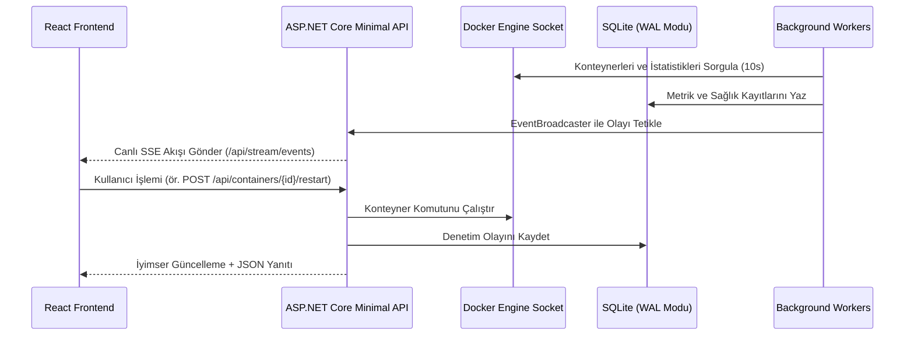

<div align="center">

[](architecture.md)
[](architecture.tr.md)

</div>

# Corvus — Klasör ve Sistem Mimarisi

Bu doküman, Corvus'un güncel dosya ve katman mimarisini, servislerini, temiz mimari standartlarını ve veri akışını belgeler.

---

## 📁 Dizin Yapısı

```
corvus/
├── docker-compose.yml
├── Dockerfile                    # Multi-stage: Frontend build + .NET 9 AOT build + minimal runtime
├── README.md                     # Proje genel bakışı ve hızlı başlangıç (İngilizce)
├── README.tr.md                  # Proje genel bakışı ve hızlı başlangıç (Türkçe)
├── CONTRIBUTING.md               # Katkı sağlama ve mimari kılavuzu (İngilizce)
├── CONTRIBUTING.tr.md            # Katkı sağlama ve mimari kılavuzu (Türkçe)
├── LICENSE
│
├── docs/
│   ├── architecture.md           # Sistem mimarisi (İngilizce)
│   ├── architecture.tr.md        # Sistem mimarisi (Türkçe)
│   ├── specification.md          # Teknik şartname (İngilizce)
│   ├── specification.tr.md       # Teknik şartname (Türkçe)
│   └── branding/                 # Vektör Marka Kimliği & Logo Kiti
│       ├── BRAND_GUIDELINES.md   # Marka kullanım rehberi, renk kodları ve standartlar
│       ├── svg/                  # Saf monokrom SVG logolar (sembol, yatay ve dikey lockup)
│       ├── web-icons/            # favicon.ico, favicon.svg, PWA manifest ve mobil ikonlar
│       └── png/                  # Yüksek çözünürlüklü şeffaf PNG çıktıları
│
├── src/
│   ├── Corvus.Api/                # Backend — ASP.NET Core Minimal API, .NET 9 Native AOT
│   │   ├── Program.cs             # Uygulama girişi, DI ve Minimal API orkestrasyonu
│   │   ├── Corvus.Api.csproj      # Native AOT, Dapper.AOT, System.GC.ConserveMemory=9
│   │   ├── Endpoints/             # Kaynak odaklı Minimal API uç noktaları (extension metodlar)
│   │   │   ├── AuthEndpoints.cs          # Session auth, kayıt yönetimi ve Zero-Trust SSO
│   │   │   ├── BackupEndpoints.cs        # Tek tıkla SQLite VACUUM INTO anlık yedek indirme
│   │   │   ├── ContainersEndpoints.cs    # Containers, /stats, /logs/stream, kontroller, Web Terminali (/terminal) ve Sistem Temizliği (/prune)
│   │   │   ├── DashboardEndpoints.cs     # 2.5s in-memory önbellekli Dashboard KPI özeti
│   │   │   ├── IncidentEndpoints.cs      # Sistem olayları ve planlı bakım CRUD & yaşam döngüsü
│   │   │   ├── MetricsEndpoints.cs       # Sistem donanım metrikleri zaman serisi (1h-1y)
│   │   │   ├── NotificationEndpoints.cs  # Çok kanallı alarm test uç noktası (Discord, Telegram, SMTP, Slack, Ntfy, Webhook)
│   │   │   ├── PushEndpoints.cs          # Push webhooks ve Dead Man's Snitch (/push-monitors)
│   │   │   ├── ServicesEndpoints.cs      # Servis CRUD ve /reorder
│   │   │   ├── SettingsEndpoints.cs      # Dinamik ayarlar (RequireAdmin), sürüm kontrolü (/version) ve DB disk telemetrisi
│   │   │   ├── StatusPageEndpoints.cs    # Şifresiz halka açık durum özeti (/api/status-page)
│   │   │   ├── StreamEndpoints.cs        # Canlı SSE olay akışı (/api/stream/events)
│   │   │   ├── UptimeEndpoints.cs        # Servis uptime denetim geçmişi, HTTP gövde doğrulaması ve ICMP ping testi
│   │   │   └── UserEndpoints.cs          # Yönetici RBAC kullanıcı yönetimi CRUD uç noktaları (/api/users)
│   │   ├── BackgroundServices/    # Arka plan çalışan iş parçacıkları
│   │   │   ├── ContainerDiscoveryService.cs  # Docker socket periyodik konteyner senkronizasyonu (10s, fingerprint & inspect cache)
│   │   │   ├── SystemMetricsCollector.cs     # Host CPU/RAM/Disk/Net metrik toplayıcısı (15s, streaming /proc/meminfo)
│   │   │   ├── UptimeCheckerService.cs       # 3 durumlu HTTP/TCP/Ping, gövde denetimi, proaktif SSL erken uyarısı ve Snitch denetimi
│   │   │   ├── MemoryTrimmerBackgroundService.cs # 3dk periyotlu SQLite havuz temizliği, PRAGMA wal_checkpoint(TRUNCATE), Gen2 agresif sıkıştırma ve malloc_trim(0)
│   │   │   └── RetentionCleanupService.cs    # Dinamik veri saklama temizleyicisi, saatlik metrik rollup (system_metrics_hourly), ikili saklama (7g ham / 365g saatlik), SQLite otomatik VACUUM freelist iadesi & GC compact (24h)
│   │   ├── Data/                  # Veri erişim katmanı (Dapper.AOT + SQLite)
│   │   │   ├── DbConnectionFactory.cs        # SQLite WAL, busy_timeout=5000 ve PRAGMA optimizasyonları
│   │   │   ├── DatabaseMigrator.cs           # DbUp sıralı göç yöneticisi
│   │   │   ├── IncidentRepository.cs         # Sistem olayları ve duyurular veri erişimi
│   │   │   ├── ServicesRepository.cs         # Servis ve override sorguları
│   │   │   ├── PushMonitorRepository.cs      # Dead Man's Snitch veri erişimi
│   │   │   ├── UptimeRepository.cs           # Uptime geçmişi ve 5s önbellekli 24h yüzde agregasyonu
│   │   │   ├── MetricsRepository.cs          # Host metrikleri, saatlik özet agregasyonu ve seyreltilmiş CTE sorguları
│   │   │   ├── BackupRepository.cs           # Push backup logları
│   │   │   ├── UserRepository.cs             # Kullanıcı hesapları ve parola hashleme
│   │   │   ├── SessionRepository.cs          # Kalıcı SQLite oturum deposu (user_sessions tablosu)
│   │   │   ├── SettingsRepository.cs         # Key-value ayarlar
│   │   │   └── Migrations/                   # Sıralı göç SQL dosyaları
│   │   │       ├── 001_init.sql
│   │   │       ├── 002_add_users.sql
│   │   │       ├── 003_roadmap_features.sql
│   │   │       ├── 004_performance_indexes.sql
│   │   │       ├── 005_service_overrides_extended.sql
│   │   │       ├── 006_uptime_advanced_options.sql
│   │   │       ├── 007_opt_in_uptime.sql         # Opt-in uptime, self-healing durum sıfırlama ve indeks
│   │   │       ├── 008_service_incidents.sql     # Sistem olayları ve planlı bakım şeması
│   │   │       ├── 009_uptime_rollup_and_transition.sql # Uptime günlük özet ve durum geçiş takibi
│   │   │       ├── 010_user_sessions.sql         # Kalıcı kullanıcı oturumları tablosu
│   │   │       ├── 011_expected_body.sql         # HTTP yanıt gövdesi kelime ve Regex doğrulama şeması
│   │   │       └── 012_metrics_hourly_rollup.sql # Saatlik telemetri özet tablosu ve indeksleri
│   │   ├── Models/                 # DTO'lar ve Veritabanı Varlıkları
│   │   │   ├── Service.cs                    # Servis modeli (check_type: http, tcp, ping, port, ssl, expected_body, is_public, display_order)
│   │   │   ├── ServiceIncident.cs            # Sistem olay duyurusu modeli
│   │   │   ├── ServiceOverride.cs            # Docker override modeli
│   │   │   ├── PushMonitor.cs                # Dead Man's Snitch modeli
│   │   │   ├── DockerModels.cs               # Docker API modelleri, prune istek/yanıtları, exec yeniden boyutlandırma çerçeveleri
│   │   │   ├── DockerActionResult.cs         # Konteyner işlem sonucu yanıtı
│   │   │   ├── SystemMetric.cs               # Host donanım metrik modeli
│   │   │   ├── UptimeCheck.cs                # Uptime denetim kayıt modeli
│   │   │   ├── BackupEvent.cs                # Backup push bildirim modeli
│   │   │   ├── User.cs                       # Kullanıcı ve rol modeli (admin, viewer)
│   │   │   ├── VersionInfo.cs                # Dinamik GitHub SemVer sürüm DTO'su
│   │   │   └── CorvusJsonSerializerContext.cs # .NET 9 Native AOT JsonSourceGeneration context
│   │   ├── Utils/                  # Yardımcı sınıflar
│   │   │   ├── StatusCodeMatcher.cs          # HTTP durum kodu (aralık ve tekil kod) ayrıştırıcı
│   │   │   ├── NativeMemoryTrimmer.cs        # Platform korumalı libc malloc_trim native bellek iade yardımcısı
│   │   │   └── HttpBodyValidator.cs          # Sıfır bellek ayırmalı 64 KB sınırlı akış ve ReDoS korumalı gövde doğrulayıcı
│   │   └── Services/                # Çekirdek iş mantığı servisleri
│   │       ├── DockerHttpClient.cs           # SocketsHttpHandler ile doğrudan Docker REST istemcisi (exec, prune, stats, logs)
│   │       ├── DockerService.cs              # 2.5s önbellekli konteyner işlemleri, sistem temizliği (prune), toplu stats özeti ve etiket eşleme
│   │       ├── DockerLogDemuxer.cs           # Multiplexed Docker stdout/stderr sıfır bellek tahsisli ayrıştırıcı
│   │       ├── IFlappingDetector.cs          # Kayan pencereli dalgalanma (flapping) algılama arayüzü
│   │       ├── FlappingDetector.cs           # Bellek içi durum geçiş takipçisi ve alarm susturma motoru
│   │       ├── NotificationService.cs        # SSRF korumalı, çift dilli Discord, Telegram, SMTP E-posta, Slack, Ntfy ve Webhook motoru
│   │       ├── EventBroadcaster.cs           # Çok istemcili Channel Pub/Sub SSE olay yayıncısı
│   │       ├── AuthService.cs                # Zero-Trust SSO, 100k PBKDF2 hash, kalıcı SQLite session store, RBAC ve kullanıcı yönetimi
│   │       ├── CorvusAuthFilter.cs           # Minimal API EndpointFilter kimlik doğrulama & RBAC katmanı (admin/viewer koruması)
│   │       └── UpdateCheckerService.cs       # GitHub Releases API sürüm kontrol servisi
│   │
│   └── Corvus.Web/                 # Frontend — TypeScript + React 19 + Vite + Tailwind CSS v4
│       ├── vite.config.ts          # manualChunks ile optimize edilmiş Vite yapılandırması
│       ├── src/
│       │   ├── main.tsx
│       │   ├── App.tsx             # React.lazy rota kod ayrıştırma, merkezi 401 dinleyicisi & SSE bağlantısı
│       │   ├── types/              # Modüler tip sözleşmeleri (Clean Architecture)
│       │   │   └── index.ts        # Tüm API, DTO ve CheckType ('http' | 'tcp' | 'docker' | 'ping') arayüz tipleri
│       │   ├── api/                # Modülerleştirilmiş API istemci katmanı
│       │   │   ├── http.ts         # fetchJson (merkezi corvus_unauthorized pencere olayı), in-memory SWR önbellek, invalidateCache
│       │   │   ├── auth.ts         # Kimlik doğrulama uç noktaları
│       │   │   ├── services.ts     # Servis CRUD ve sıralama
│       │   │   ├── containers.ts   # Konteyner işlemleri, toplu stats (/stats-summary) ve loglar
│       │   │   ├── uptime.ts       # Uptime kontrolleri ve push monitörleri
│       │   │   ├── metrics.ts      # Donanım metrikleri
│       │   │   ├── settings.ts     # Ayarlar ve yedekleme
│       │   │   ├── index.ts        # Birleşik API nesnesi
│       │   │   └── client.ts       # Geriye dönük uyumluluk re-export katmanı
│       │   ├── i18n/               # Derleme anında tip güvenli çoklu dil sistemi
│       │   │   ├── en.ts           # Birincil İngilizce sözlük
│       │   │   ├── tr.ts           # Türkçe çeviri sözlüğü
│       │   │   ├── types.ts        # DeepStringify ve sözlük tipleri
│       │   │   └── index.tsx       # I18nProvider ve useI18n hook'u
│       │   ├── utils/              # Modüler yardımcı fonksiyonlar
│       │   │   ├── url.ts          # Servis URL formatlama ve güvenli dönüştürme
│       │   │   ├── format.ts       # Bayt dönüştürme (B, KB, MB, GB, TB) yardımcı modülü
│       │   │   └── grouping.ts     # Docker Compose akıllı gruplama mantığı
│       │   ├── components/         # SADECE ortak/paylaşılan global UI bileşenleri
│       │   │   ├── Sidebar.tsx               # Masaüstü ray menü (hidden lg:flex)
│       │   │   ├── BottomNav.tsx             # Mobil Cam Altbar — 7 sekmeli buzlu cam gezinti çubuğu
│       │   │   ├── StatusBadge.tsx           # Sağlık durumu rozeti (healthy, degraded, down)
│       │   │   ├── LanguageSwitch.tsx        # Kompakt ve tam modlu arayüz dil değiştirici
│       │   │   ├── EmailRecipientInput.tsx   # Etiket/çip tabanlı çoklu e-posta alıcı giriş bileşeni
│       │   │   └── RegistrationPromptModal.tsx # İlk yönetici kayıt yönlendirme modalı
│       │   └── pages/              # Modüler özellik bazlı sayfa klasörleri
│       │       ├── AuthPage/
│       │       │   └── index.tsx             # Giriş ve kayıt ekranı
│       │       ├── Containers/
│       │       │   ├── index.tsx             # Toplu stats ile çalışan sayfa yöneticisi (<250 satır)
│       │       │   ├── ContainerList.tsx     # Duyarlı mobil kartlar ve masaüstü tablo görünümü
│       │       │   ├── ComposeStackGroup.tsx # Docker Compose stack projeleri için akordiyon bileşeni
│       │       │   ├── ContainerStatsBadges.tsx # CPU, RAM ve Ağ canlı rozetleri
│       │       │   ├── ContainerActionButtons.tsx # Yaşam döngüsü butonları, log ve terminal tetikleyicisi
│       │       │   ├── ContainerLogsModal.tsx   # Canlı konteyner log terminali modalı
│       │       │   ├── ContainerTerminalModal.tsx # Tarayıcı içi interaktif web terminali (@xterm/xterm, shell seçici, PTY resize)
│       │       │   └── SystemPruneModal.tsx     # Tek tıkla disk alanı temizliği (imaj, konteyner, hacim, ağ, derleme önbelleği)
│       │       ├── Dashboard/
│       │       │   ├── index.tsx             # Konsolide KPI özeti ve çalışan servisler
│       │       │   ├── SystemPulseHero.tsx   # Canlı durum nabzı, ağ I/O ve güncelleme kontrol kartı
│       │       │   ├── SystemKpiStrip.tsx    # 2 sütunlu kompakt KPI şeridi ve tam genişlikte Disk çubuğu
│       │       │   ├── AttentionRequiredCard.tsx # Kritik arızalar ve SSL uyarıları kartı
│       │       │   └── ActiveContainersWidget.tsx # 2 sütunlu duyarlı aktif konteynerler kartı
│       │       ├── Profile/
│       │       │   ├── index.tsx             # Profil ve kullanıcı yönetimi sayfası kabuğu
│       │       │   ├── ProfileSecurityTab.tsx # Şifre değiştirme ve 2FA güvenlik sekmesi
│       │       │   ├── ProfileUsersTab.tsx   # Yöneticiler için kullanıcı listesi ve rol yönetimi
│       │       │   └── AddUserModal.tsx      # Yeni kullanıcı oluşturma modalı
│       │       ├── PublicStatus/
│       │       │   ├── index.tsx             # Şifresiz halka açık durum sayfası (/status)
│       │       │   ├── PublicStatusCategoryGroup.tsx # Kategori bazlı açılır/kapanır akordeon grupları
│       │       │   ├── PublicStatusIncidentBanner.tsx # Canlı olay ve planlı bakım duyuru afişi
│       │       │   ├── PublicStatusServiceBar.tsx # Son 30 denetim etkileşimli durum çubuğu
│       │       │   └── PublicStatusServiceCard.tsx # Detaylı servis durum ve uptime kartı
│       │       ├── Services/
│       │       │   ├── index.tsx             # Servis launcher ve sürükle-bırak sıralama
│       │       │   ├── ServiceCard.tsx       # Servis kartı (HTTP, TCP, PING, Docker rozetleri)
│       │       │   ├── AddServiceModal.tsx   # Manuel servis ekleme modalı (ICMP Ping ve gövde doğrulama seçeneğiyle)
│       │       │   ├── EditServiceModal.tsx  # Servis uç noktası, ters proxy URL ve kontrol türü düzenleme modalı
│       │       │   └── AdvancedCheckOptions.tsx # Bağımsız gelişmiş kontrol parametreleri akordiyonu (zaman aşımı, TLS, gövde, kodlar)
│       │       ├── Settings/
│       │       │   ├── index.tsx             # Tek kolonlu (max-w-4xl) modern ayarlar kabuğu ve başlık sürüm rozeti
│       │       │   ├── GeneralSettingsTab.tsx # Genel ayarlar, retention ve DB boyutu telemetrisi
│       │       │   ├── NotificationSettingsTab.tsx # Çok kanallı alarm yapılandırması (Discord, Telegram, SMTP, Slack, Ntfy, Webhook)
│       │       │   ├── BackupSettingsTab.tsx # Çift yönlü dahili/harici yedekleme yöneticisi
│       │       │   └── notifications/        # Modüler bildirim kanalı panelleri
│       │       │       ├── EmailChannelPanel.tsx       # SMTP sunucu, port, TLS, gönderen adı ve çoklu alıcı yönetimi
│       │       │       ├── SlackChannelPanel.tsx       # Slack gelen webhook URL ve kanal test tetikleyicisi
│       │       │       ├── FlappingProtectionCard.tsx  # Dalgalanma eşiği, kayan pencere ve kararlılık kontrol ayarları
│       │       │       └── NotificationEventFilters.tsx # Olay bazlı bildirim filtreleri (down, up, ssl, flapping)
│       │       ├── SystemMetrics/
│       │       │   ├── index.tsx             # Zaman serisi telemetri kabuğu ve periyot filtresi (1h, 6h, 12h, 24h, 7d, 30d, 90d, 1y)
│       │       │   ├── SystemKpiCards.tsx    # Canlı donanım kullanım kartları
│       │       │   ├── CpuMetricsChart.tsx   # CPU yükü alan grafiği
│       │       │   ├── RamMetricsChart.tsx   # Bellek kullanımı alan grafiği
│       │       │   └── DiskStorageCard.tsx   # Disk depolama ve bölüm dağılımı
│       │       └── Uptime/
│       │           ├── index.tsx             # Uptime kabuğu ve sekme seçici
│       │           ├── PingUptimeTab.tsx     # HTTP/TCP/ICMP ping, gecikme ve SSL takibi ana sekmesi
│       │           ├── PushMonitorsTab.tsx   # Dead Man's Snitch cron izleme listesi
│       │           ├── IncidentsTab.tsx      # Sistem olayları ve planlı bakım yönetim sekmesi
│       │           ├── AddSnitchModal.tsx    # Push monitor oluşturma modalı
│       │           ├── UptimeStatsCards.tsx  # KPI kartları ve uç nokta düzenleme tetikleyicisi
│       │           ├── UptimeRecentChecks.tsx# Son Uptime kontrolleri listesi
│       │           ├── UptimeBar.tsx         # Geçmiş 90 günlük uptime çubuğu
│       │           └── components/           # Modüler Uptime alt bileşenleri
│       │               ├── DiscoveredServicesSection.tsx # Keşfedilen izlenmeyen servisler havuzu
│       │               ├── EnableUptimeModal.tsx          # Akıllı ön dolumlu canlı bağlantı test modalı
│       │               ├── AddIncidentModal.tsx           # Olay ve planlı bakım oluşturma modalı
│       │               └── DisableUptimeDialog.tsx        # Takipten çıkarma onay diyaloğu
│       └── wwwroot/                # Üretime hazır derlenmiş arayüz paketi (Corvus.Api tarafından sunulur)
│
├── tests/
│   └── Corvus.Api.Tests/           # xUnit Test Paketi (211 Başarılı Test)
│       ├── AuthServiceTests.cs
│       ├── DockerServiceTests.cs     # Konteyner işlemleri, sistem temizliği, micro-cache ve batch stats testleri
│       ├── DockerLogDemuxerTests.cs
│       ├── FlappingDetectorTests.cs  # Kayan pencere durum takibi ve dalgalanma alarm susturma testleri
│       ├── HttpBodyValidatorTests.cs # Sıfır bellek tahsisli gövde arama ve ReDoS zaman aşımı testleri
│       ├── MemoryTrimmerTests.cs     # Native memory trimmer ve GC optimizasyon testleri
│       ├── MetricsRepositoryTests.cs # Saatlik agregasyon, çift aşamalı retention ve seyreltme sorgu testleri
│       ├── NotificationServiceTests.cs # Çok kanallı bildirim testleri (Discord, Telegram, SMTP, Slack, Ntfy, Webhook)
│       ├── RoadmapFeaturesTests.cs
│       ├── UpdateCheckerTests.cs
│       ├── StatusCodeMatcherTests.cs
│       └── DatabaseMigrationAndRepositoryTests.cs
│
└── docs/                           # Teknik şartnameler ve mimari kılavuzlar
    ├── branding/                   # Hex Sentinel kurumsal kimlik, SVG master vektörleri ve web ikonları
    │   ├── BRAND_GUIDELINES.md     # Logo kullanım kılavuzu, renk kodları ve tipografi
    │   ├── svg/                    # Master vektör logolar ve yatay/dikey lockup'lar
    │   └── web-icons/              # Favicon, apple-touch-icon, PWA ikonları ve manifest
    ├── architecture.md             # Sistem mimarisi (İngilizce)
    ├── architecture.tr.md          # Sistem mimarisi (Türkçe)
    ├── specification.md            # Teknik şartname (İngilizce)
    ├── specification.tr.md         # Teknik şartname (Türkçe)
    ├── design-system.md            # Tasarım sistemi ve arayüz tokenları (İngilizce)
    └── design-system.tr.md         # Tasarım sistemi ve arayüz tokenları (Türkçe)
```

---

## 🏛️ Temiz Mimari ve Modülerlik İlkeleri

Corvus, kod tabanının açık kaynak dünyasında örnek gösterilecek seviyede şeffaf, sürdürülebilir ve katkı sağlamaya elverişli kalabilmesi için **Temiz Mimari** ve **Tek Sorumluluk** ilkelerini sıkı şekilde uygular:

### 1. Tek Dosyaya Kod Yığma Yasağı (Anti-Monolith Kuralı)
- Hiçbir dosya kendi temel sorumluluğu dışındaki kodlarla şişirilemez. Sayfalar modüler özellik klasörlerine (`pages/<Özellik>/index.tsx`) bölünür; sekmeler, formlar ve modallar bağımsız alt bileşen dosyalarına çıkarılır.

### 2. Merkezileştirilmiş API Servis Katmanı
- UI bileşenleri içinde **asla** ham `fetch()` çağrıları veya HTTP protokol detayları bulunmaz.
- Tüm backend iletişimi `src/api/client.ts` içinde tip korumalı olarak tanımlanır. Sayfalar doğrudan `api.getServices()`, `api.startContainer()` vb. çağrılar yapar.

### 3. Sayfaya Özgü Modallar ve Sekmeler
- Yalnızca tek bir sayfaya ait olan modallar, sekmeler ve diyaloglar doğrudan o sayfanın klasöründe yer alır (ör. `pages/Services/AddServiceModal.tsx`, `pages/Uptime/AddSnitchModal.tsx`, `pages/Containers/ContainerLogsModal.tsx`).
- `src/components/` dizini kesinlikle yalnızca tüm projede ortak kullanılan (`Sidebar`, `StatusBadge`, `LanguageSwitch`, `RegistrationPromptModal`) bileşenlere ayrılmıştır.

### 4. Yardımcı Fonksiyonların İzolasyonu
- URL dönüştürme, formatlama ve hesaplama mantıkları JSX render ağacının içine gömülmez. `src/utils/` (`url.ts`, `format.ts`) altında modülerleştirilerek dışa aktarılır.

### 5. Backend Dikey Dilimleri (Vertical Slices)
- Minimal API endpoint'leri `Endpoints/` altında domain bazında extension metodlar olarak gruplanır (`app.MapContainersEndpoints()`, `app.MapServicesEndpoints()`).
- Veri erişimi `Data/` altında Dapper repository'lerine bölünmüştür.
- Arka plan işleri birbirinden bağımsız `BackgroundService` sınıflarında yürütülür.

---

## 🔄 Veri Akışı ve Gerçek Zamanlı Güncellemeler


```mermaid
sequenceDiagram
    participant Browser as React Frontend
    participant API as ASP.NET Core Minimal API
    participant Docker as Docker Engine Socket
    participant SQLite as SQLite (WAL Modu)
    participant Worker as Background Workers

    Worker->>Docker: Konteynerleri ve İstatistikleri Sorgula (10s)
    Worker->>SQLite: Metrik ve Sağlık Kayıtlarını Yaz
    Worker->>API: EventBroadcaster ile Olayı Tetikle
    API-->>Browser: Canlı SSE Akışı Gönder (/api/stream/events)
    Browser->>API: Kullanıcı İşlemi (ör. POST /api/containers/{id}/restart)
    API->>Docker: Konteyner Komutunu Çalıştır
    API->>SQLite: Denetim Olayını Kaydet
    API-->>Browser: İyimser Güncelleme + JSON Yanıtı
```

---

## 🧠 Bellek Dayanıklılığı, Caching ve In-Memory Optimizasyonları

Corvus, harici bir önbellek sunucusu (Redis vb.) çalıştırmadan sistem belleğini **30–45 MB** bandında tutmak için çok katmanlı bir optimizasyon mimarisi uygular:

1. **Sıfır Dış Bağımlılıklı Micro-Cache:**
   - Docker soket okumaları (`GetContainersAsync`) ve Dashboard özetleri (`GET /api/dashboard/summary`) 2.5 saniyelik mikro önbelleğe alınır.
   - Uptime 24 saatlik yüzde agregasyonları (`Get24hUptimePercentagesAsync`) 5 saniye önbellekte tutulur.
   - Hızlı sayfa geçişlerinde Docker soketi ve SQLite üzerinde oluşan nesne tahsisatları (allocations) %90 oranında engellenir.
2. **Toplu İstatistikler (Batch Stats Endpoint):**
   - Konteyner başına N+1 paralel `/stats` isteği yerine `GET /api/containers/stats-summary` ile çalışan tüm konteynerlerin metrikleri tek bir HTTP akışında toplanır.
3. **Akıllı Konteyner Keşfi Parmak İzi (Fingerprinting) ve Inspect Önbelleği:**
   - `ContainerDiscoveryService`, konteyner ID ve imaj ID bazlı ortam değişkenlerini önbelleğe alır (`_inspectCache`); her döngüde Docker soketine gereksiz `inspect` çağrıları yapılmasını önler.
   - `ComputeFingerprint` algoritması ile konteyner durumları ve URL'leri hash'lenir. Durum değişmediğinde SQLite veritabanına yazma işlemleri tamamen atlanır; disk I/O ve log yıpranması önlenir.
4. **.NET 9 Bellek Tasarruf Yapılandırması ve GC Sınırlandırması:**
   - `DOTNET_GCConserveMemory=9`: İstek dalgalanmaları bittiğinde boşta kalan sanal sayfaların Linux çekirdeğine (`madvise`) agresif şekilde iade edilmesini sağlar.
   - `DOTNET_GCHeapHardLimit=0x3000000`: Yönetilen GC öbeğini 48 MB ile sınırlandırarak küçük VPS'lerde bellek taşmasını engeller.
   - `MALLOC_ARENA_MAX=2` ve `MALLOC_TRIM_THRESHOLD_=65536`: Çok iş parçacıklı glibc bellek parçalanmasını (fragmentation) önler.
5. **Periyodik Native ve Yönetilen Bellek Temizleyici (`MemoryTrimmerBackgroundService`):**
   - Her 3 dakikada bir otomatik çalışır; SQLite bağlantı havuzunu boşaltır (`SqliteConnection.ClearAllPools()`), Gen 1 GC optimizasyonu tetikler ve libc `malloc_trim(0)` çağırarak kullanılmayan native belleği işletim sistemine iade eder.
   - `SystemMetricsCollector`, `/proc/meminfo` dosyasını belleğe tamamen yüklemek yerine `File.ReadLines()` ile akış halinde okur ve `MemTotal`/`MemAvailable` satırlarını bulduğu anda okumayı sonlandırır.
6. **Sıfır Gövde Tahsisatlı Sağlık Denetimi:**
   - `UptimeCheckerService` içerisindeki sağlık denetimlerinde `HttpCompletionOption.ResponseHeadersRead` ve anında `using` elden çıkarma mimarisi ile uzak servis yanıt gövdelerinin belleğe çekilmesi engellenir.
   - SQLite bağlantı havuzu `PRAGMA cache_size = -2000;` ile bağlantı başına en fazla 2MB sayfa önbelleği ile sınırlandırılır.

---

## 🛡️ Gelişmiş 3 Durumlu Dayanıklılık ve Sağlık Motoru

Servis sağlığı kontrollerinde geçici ağ dalgalanmalarının yanlış alarm (false-positive) üretmesini önlemek için 3 durumlu sonlu durum makinesi (finite state machine) kullanılır:
- **`healthy`:** Servis yanıt veriyor ve HTTP 2xx/3xx veya açık TCP portu doğrulandı.
- **`degraded`:** İlk başarısızlık tespit edildi; sistem alarm üretmez, servisi sarı uyarı moduna alır.
- **`down`:** 3 ardışık başarısızlık sonrasında servis kırmızıya döner ve yapılandırılmış bildirim kanallarına (Discord, Telegram, vb.) alarm fırlatılır.
- **Loopback Ağ Çözümlemesi:** Docker içinde çalışan Corvus'un host üzerindeki servislere (`localhost`, `127.0.0.1`) erişebilmesi için varsayılan bridge ağ geçidi (`host.docker.internal`) otomatik çözümlenir.

---

## 🧹 Veri Saklama, Uptime Agregasyonu & Olay Yaşam Döngüsü Mimarisi

### 1. Akıllı 24 Saatlik Retention Temizliği (`is_transition`)
Yüksek sıklıkta yapılan sağlık denetimleri zamanla milyonlarca satır üretir. SQLite sorgularının mikrosaniye seviyesinde kalmasını sağlamak ve disk büyümesini engellerken denetim tutarlılığını korumak için:
- Servis durumunun değişmediği rutin kontroller `is_transition = 0` bayrağıyla kaydedilir.
- Servisin durumunun değiştiği tüm anlar (`up` ➔ `down` veya `down` ➔ `up`) `is_transition = 1` olarak işaretlenir.
- `RetentionCleanupService` günde bir kez çalışır: 24 saatten eski ve durum değişimi içermeyen rutin kontroller (`is_transition = 0`) `idx_uptime_checks_cleanup` indeksi üzerinden anında temizlenir. Durum değişim anları (`is_transition = 1`) ise kullanıcının belirlediği `retention_days` süresince denetim amaçlı saklanır.

### 2. 365 Günlük Günlük İstatistik Özeti (`uptime_daily_stats`)
Eski ham kontroller silinmeden hemen önce, her servis için günlük istatistikler özetlenerek `uptime_daily_stats` tablosuna işlenir:
- Her takvim günü (`date`) için servisin `total_checks`, `up_checks` ve `avg_response_time_ms` metrikleri hesaplanır.
- 30 günlük, 90 günlük ve 365 günlük SLA ve Uptime oranları, devasa `uptime_checks` tablosu taranmadan doğrudan bu hafif özet tablosu üzerinden anlık hesaplanır.
- 365 günden eski özet kayıtları temizlenerek, tam 1 yıllık SLA geçmişi yalnızca birkaç kilobaytlık bir alanda kalıcı olarak tutulur.

### 4. Zaman Serisi Telemetri Seyreltme & Saatlik Özetler (`system_metrics_hourly`)
15 saniyelik ham sistem kaynak metrikleri zamanla yüz binlerce satıra ulaşır. Corvus, çift aşamalı bir seyreltme (downsampling) politikası uygular:
- **7 Günlük Yüksek Çözünürlüklü Ham Saklama:** Tam 15 saniyelik detaylı kayıtlar (`system_metrics`), yakın geçmişteki hata ayıklama ve anlık analizler için 7 gün boyunca saklanır.
- **Otomatik Saatlik Agregasyon (`AggregateHourlyMetricsAsync`):** Tamamlanmış geçmiş saatler `RetentionCleanupService` ve `MetricsRepository` tarafından matematiksel idempotency ile ortalama CPU, RAM, Disk, Ağ I/O ve pik kapasiteler hesaplanarak `system_metrics_hourly` tablosuna aktarılır.
- **365 Günlük Özet Saklama:** Saatlik özetler 365 gün (veya belirlenen retention süresi) boyunca korunur.
- **Birleşik Sorgu Dağıtıcısı:** Uzun vadeli aralıklar (`30d`, `90d`, `1y`) için `GetRecentAsync`, indeksli saatlik özetler ile henüz özetlenmemiş en son saatleri anında birleştiren optimize bir SQLite CTE çalıştırarak grafiklerin milisaniyeler içinde sıfır veri boşluğuyla çizilmesini sağlar.

---

## 💻 Tarayıcı İçi Konteyner Web Terminali & Sistem Temizliği Mimarisi

### 1. Sıfır Bellek Tahsisatlı (Zero-Allocation) WebSocket Exec Proxy (`/terminal`)
- **Doğrudan Kabuk Erişimi:** Kullanıcılar tarayıcı üzerinden doğrudan çalışan Docker konteynerlerinin içine interaktif kabuk (`/bin/sh`, `/bin/bash`, `/bin/ash`, `/bin/zsh`) başlatabilir.
- **Çift Yönlü Proxy:** ASP.NET Core Native AOT arka ucu, Docker daemon ile HTTP 1.1 Upgrade bağlantısı (`/exec/{id}/start`) kurar ve bunu istemci WebSocket'ine sıfır kopya ile köprüler.
- **Sıfır GC Yükü:** `ArrayPool<byte>.Shared` üzerinden kiralanan 8 KB'lık sabit tamponlar kullanılır; yoğun terminal oturumlarında bile heap üzerinde çöp bellek tahsisatı yapılmaz.
- **Anında Kaynak İadesi:** İstemci ayrıldığında veya modal kapandığında Docker exec süreci derhal öldürülür, kiralanan bellekler iade edilir ve Corvus RAM tüketimi taban seviyesine (~30 MB) döner.
- **Dinamik PTY Boyutlandırma:** İstemci `{type: "resize", cols, rows}` kontrol mesajları gönderir; bu mesajlar doğrudan Docker `/exec/{id}/resize` API çağrılarına dönüştürülür.
- **RBAC Güvenliği:** Terminal erişimi `[RequireAdmin]` ile korunur (Gözlemci/Viewer rolleri için 403 Forbidden).

### 2. Docker Sistem Temizliği & Disk Kurtarma (`/prune`)
- **Doğrudan Daemon Orkestrasyonu:** `/containers/prune`, `/images/prune`, `/volumes/prune`, `/networks/prune` ve `/build/prune` uç noktaları üzerinden kapsamlı temizlik yürütür.
- **Kalıcı Veri Koruması:** `Volumes` seçeneği varsayılan olarak kapalı tutulur ve seçildiğinde belirgin bir sarı uyarı şeridi sergilenir. Dangling vs tüm kullanılmayan imaj seçimi sunulur.
- **Ayrıntılı Tasarruf Denetimi:** Kategorilere göre (İmajlar, Konteynerler, Hacimler, Ağlar, Derleme Önbelleği) kurtarılan baytları listeler ve toplam geri kazanımı raporlar (`1.42 GB serbest bırakıldı`).

---

## 🔕 Akıllı Dalgalanma Engelleme & Alarm Susturma (`FlappingDetector`)

### 1. Kayan Pencere Durum Takibi
Kısa süre içinde sürekli `up` ve `down` arasında gidip gelen servisler operasyon ekiplerinde alarm yorgunluğuna ve bildirim kirliliğine yol açar. Corvus, bellek içi `IFlappingDetector` motorunu sunar:
- Servisin durum değişim zaman damgalarını yapılandırılabilir kayan bir pencerede (varsayılan: 5 dakika) izler.
- **Susturma Eşiği:** Değişim sayısı eşiğe (varsayılan: 4 değişim) ulaştığında servis dalgalanma (flapping) durumuna geçer. Corvus tek bir Sarı uyarı bildirimi (`[DALGALANMA TESPİT EDİLDİ]`) gönderir ve ara durum bildirimlerini tamamen susturur.
- **Kararlılık ve Kurtarma:** Servis belirlenen sayıda ardışık başarılı kontrol (varsayılan: 3 kontrol) sağladığında susturma kaldırılır ve tek bir Yeşil kurtarma bildirimi (`[DALGALANMA SONA ERDİ]`) iletilir.
- **Sıfır Bellek Sızıntısı:** Bellek içi geçiş geçmişi düzenli olarak budanarak uzun çalışma sürelerinde RAM şişmesi engellenir.

### 2. Çok Kanallı Alarm Dağıtıcısı (`NotificationService`)
- Dışa aktarılan alarmlar **Discord** (renkli zengin embed), **Telegram** (MarkdownV2), **E-posta (SMTP)** (responsive koyu mod HTML şablonu ve çoklu alıcı), **Slack** (renk vurgulu attachment'lar), **Ntfy / Gotify** (özel etiketler ve öncelik seviyeleri) ve **Özel Webhook** kanallarını destekler.

---

## 🔍 HTTP Yanıt Gövdesi Doğrulama Motoru (`HttpBodyValidator`)

### 1. Yük İçeriği Denetimi
HTTP 200 dönen servisler arka planda veritabanı bağlantı hatası veya uygulama arıza sayfası veriyor olabilir. Corvus derin yük doğrulaması sunar:
- **Anahtar Kelime Eşleme:** Belirli anahtar kelimelerin (`"status":"healthy"`, `"database":"connected"`) varlığını doğrular.
- **Regex Desen Eşleme:** Derlenmiş düzenli ifadelerle karmaşık durum yanıtlarını denetler.

### 2. Sıfır Bellek Tahsisli 64 KB Sınırı & ReDoS Koruması
- Yanıt gövdesini sınırsızca belleğe çekmek yerine `HttpBodyValidator`, `ArrayPool<byte>` tamponları üzerinden en fazla 64 KB'a kadar akış okuması yapar.
- Regex değerlendirmeleri, Regular Expression Denial of Service (ReDoS) açıklarını önlemek için katı bir 200ms zaman aşımı ile sınırlandırılmıştır.

---

## 💡 İlham Kaynakları (Inspirations & Credits)
- [Uptime Kuma](https://github.com/louislam/uptime-kuma) — İzleme mantığı ve durum sayfası felsefesi
- [Beszel](https://github.com/henrygd/beszel) — Hafif telemetri ve sistem kaynak takibi yaklaşımı
- [Portainer](https://github.com/portainer/portainer) — Konteyner yaşam döngüsü vizyonu

